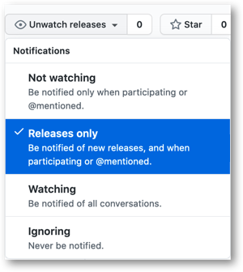

  
  <h1 align="center">Prisma Cloud Policy Updates</h1>

Get notified of policy changes coming in Prisma Cloud releases

 

## Overview

The JSON files in this repo contain new and updated policies planned for the
upcoming release. The JSON files have the policy metadata, remediation, and RQL
information.

Each JSON block represents a policy, the JSON fields with the suffix "_updated"
represents the updated value for the field in the updated policy.

## Notifications

To get notified of new policy changes, at the top right corner of GitHub select
**Watch** -> **Releases only**

 releases only" />

## Notes

* The release notice currently includes only RQL based policies (Config, Network, and Audit Event policies). Other policy types (Anomaly, Data, Build) are not included. 
* Saved searches not part of default policies are currently not included.
* Compliance changes are currently not included.

*The JSON files contain custom data fields in addition to the data from the Prisma Cloud Policy and Search Manager API endpoints*